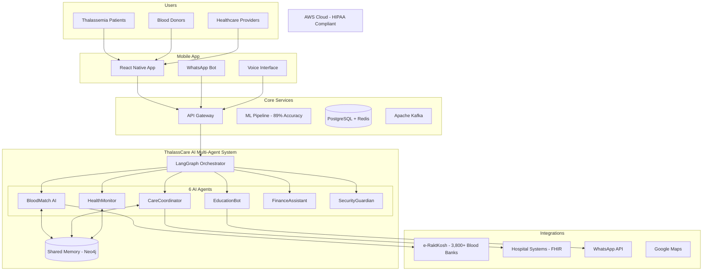

# ThalassCare AI

> **Empowering Thalassemia Patients with AI-Driven Care Management**

A comprehensive mobile health application designed to revolutionize care management for thalassemia patients through intelligent tracking, predictive analytics, and seamless healthcare coordination.

---

## The Problem

### Thalassemia: A Silent Battle

Thalassemia is a genetic blood disorder affecting **over 270 million carriers worldwide**, with approximately **100,000 patients in India alone** requiring regular blood transfusions to survive.

**Challenges faced by patients:**

- **Lifelong Dependency:** Patients need blood transfusions every 2-4 weeks throughout their lives
- **Iron Overload Crisis:** Regular transfusions lead to dangerous iron accumulation requiring daily chelation therapy
- **Fragmented Care:** Medical records scattered across multiple hospitals and blood banks
- **Blood Availability Anxiety:** Constant uncertainty about blood availability, especially for rare blood types
- **Financial Burden:** Treatment costs of ₹1-2 lakhs annually push families into poverty
- **Information Gap:** Limited access to disease education and self-management resources
- **Emotional Toll:** Isolation, anxiety, and lack of peer support

### The Reality

```
Every 8 minutes, a child is born with thalassemia in India.
Only 50% of patients survive beyond 20 years due to inadequate care.
```

---

## The Solution

### ThalassCare AI: Your Complete Care Companion

ThalassCare AI transforms thalassemia management from a fragmented, stressful experience into a streamlined, supportive journey. Our app puts patients at the center of their care with AI-powered insights and comprehensive tracking.

**Our Mission:** No patient should miss a transfusion. No family should navigate this journey alone.

---

## Key Features

### 1. Smart Dashboard
- **Health Score:** AI-calculated wellness score (1-100) based on your vitals and trends
- **Transfusion Countdown:** Visual countdown to next scheduled transfusion
- **Quick Actions:** One-tap access to emergency blood request, symptom logging, and doctor calls
- **Personalized Insights:** AI-generated health tips tailored to your condition

### 2. Comprehensive Health Tracking
- **Blood Work Monitoring:** Track hemoglobin, ferritin, and other critical markers
- **Iron Overload Alerts:** Visual indicators when ferritin levels approach dangerous thresholds
- **Symptom Journal:** Easy-to-use daily symptom checker with severity tracking
- **Medication Tracker:** Never miss chelation therapy or folic acid supplements
- **Vitals Dashboard:** Monitor heart rate, blood pressure, SpO2, and temperature

### 3. Transfusion & Appointment Management
- **Smart Scheduling:** Calendar view of all transfusions and appointments
- **Blood Bank Integration:** Real-time blood availability from 3,800+ centers via e-RaktKosh
- **Preparation Checklists:** Pre-transfusion reminders and checklists
- **Doctor Directory:** Quick access to your care team with one-tap calling

### 4. Education & Resources
- **Disease Education:** Simple, illustrated guides about thalassemia management
- **Video Library:** Patient stories, doctor explanations, and self-care tutorials
- **Nutrition Guidance:** Iron-safe diet recommendations and meal planning
- **Exercise Tips:** Safe physical activity guidelines for thalassemia patients

### 5. Community & Support
- **Peer Connection:** Connect with other patients and families
- **Support Groups:** Find local and online thalassemia support communities
- **Caregiver Resources:** Dedicated content for parents and caregivers
- **Mental Health:** Access to counseling resources and crisis support

### 6. Financial Assistance
- **Government Schemes:** Complete guide to Thalassemia Bal Sewa Yojana and other programs
- **Insurance Navigation:** Help with medical insurance claims and coverage
- **Cost Calculator:** Estimate and track treatment expenses
- **NGO Directory:** Connect with organizations offering financial support

---

## App Screens

| Dashboard | Health Tracking | Schedule | Resources | Profile |
|:---------:|:---------------:|:--------:|:---------:|:-------:|
| Health overview & quick actions | Blood work, symptoms & medications | Transfusions & appointments | Education & community | Medical info & settings |

---

## Technology Stack

### Frontend
- **React Native** with Expo SDK 54
- **TypeScript** for type safety
- **Expo Router** for navigation
- **React Native SVG** for charts and visualizations

### Design
- **Modern UI/UX** with calming teal color palette
- **Accessibility-first** design with large touch targets
- **Responsive layouts** for all device sizes

### Backend Architecture (Planned)
- **LangGraph** Multi-Agent AI System
- **PostgreSQL** + **Redis** for data storage
- **Apache Kafka** for real-time messaging
- **AWS Cloud** with HIPAA compliance

---

## System Architecture



---

## Getting Started

### Prerequisites
- Node.js 18+
- npm or yarn
- Expo CLI
- iOS Simulator / Android Emulator / Physical device with Expo Go

### Installation

```bash
# Clone the repository
git clone https://github.com/Aakashdeep-Srivastava/-ThalassCare-AI-.git

# Navigate to project directory
cd -ThalassCare-AI-

# Install dependencies
npm install

# Start the development server
npx expo start
```

### Running the App

```bash
# For iOS
npx expo start --ios

# For Android
npx expo start --android

# For Web
npx expo start --web
```

---

## Project Structure

```
ThalassCare-AI/
├── app/                    # Expo Router screens
│   ├── (tabs)/            # Tab navigation screens
│   │   ├── index.tsx      # Dashboard
│   │   ├── health.tsx     # Health tracking
│   │   ├── appointments.tsx # Schedule
│   │   ├── resources.tsx  # Learn & community
│   │   └── profile.tsx    # Profile & settings
│   └── _layout.tsx        # Root layout
├── components/            # Reusable components
│   ├── Header.tsx
│   ├── HealthCard.tsx
│   ├── QuickAction.tsx
│   └── ...
├── constants/             # Theme and configuration
│   ├── theme.ts          # Colors, spacing, typography
│   └── data.ts           # Demo data
├── context/              # React Context providers
│   └── AppContext.tsx
├── types/                # TypeScript definitions
│   └── index.ts
└── utils/                # Helper functions
    └── helpers.ts
```

---

## Key Innovations

| Innovation | Description | Impact |
|------------|-------------|--------|
| **72-Hour Blood Prediction** | ML model predicts blood availability | 89% accuracy in forecasting |
| **e-RaktKosh Integration** | Real-time government blood bank data | Access to 3,800+ centers |
| **Multi-Agent AI** | 6 specialized AI agents for comprehensive care | Personalized, automated support |
| **WhatsApp Access** | No app download required | Reaches 500M+ users instantly |

---

## Roadmap

- [x] Mobile app UI with 5 core screens
- [x] Health tracking with symptom logging
- [x] Medication and transfusion scheduling
- [x] Educational resources and community features
- [ ] AI-powered health insights integration
- [ ] e-RaktKosh API integration
- [ ] WhatsApp bot deployment
- [ ] Multi-language support (Hindi, Tamil, Bengali)
- [ ] Wearable device integration
- [ ] Telemedicine video consultations

---

## Contributing

We welcome contributions from developers, healthcare professionals, and the thalassemia community!

1. Fork the repository
2. Create your feature branch (`git checkout -b feature/AmazingFeature`)
3. Commit your changes (`git commit -m 'Add some AmazingFeature'`)
4. Push to the branch (`git push origin feature/AmazingFeature`)
5. Open a Pull Request

---

## Support

If you or someone you know is affected by thalassemia, these resources can help:

- **Thalassemia International Federation:** [thalassaemia.org.cy](https://thalassaemia.org.cy)
- **Thalassemics India:** [thalassemicsindia.org](https://www.thalassemicsindia.org)
- **National Health Portal India:** [nhp.gov.in](https://www.nhp.gov.in)

---

## License

This project is licensed under the MIT License - see the [LICENSE](LICENSE) file for details.

---

## Acknowledgments

- Thalassemia patient communities for their invaluable feedback
- Healthcare professionals who guided feature development
- Open-source contributors and the React Native community

---

<p align="center">
  <strong>Built with care for the thalassemia community</strong>
  <br>
  <sub>Together, we can make every transfusion count.</sub>
</p>
